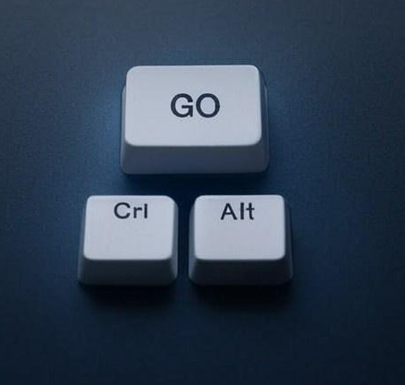

# ctrlAltGo
Library for taking full control of linux kernel without normal userland software with customized appliance code

**NOTICE: THIS LIBRARY IS JUST STARTED**

Idea of this repository is to offer parts and for building init program for initramfs.
Design philosophy of ctrlAltGo is based on gokrazy but ctrlAltGo is more modular and customizable.

Following design points
1. This is about building appliances and gadgets, not computer distro
2. Do not let unix standard limit your device design
3. No part is best part
4. There is no need for shell/command prompt or utility
5. Non mutable, starts same point every time
6. Golang and zig compilers are good. No complex build system needed like buildroot
7. Scripts are bad hack. Bad to unit test. Too easy to break something. Hard to parse. Hard to keep settings value sync with UI
8. Static linking makes life easy
9. Tailor everything for your use case
10. Make things working concurently. Goroutines are lightweight.

TODO say that actual application should be other than PID1 program

There are several components. Idea is to contain all components needed for building proper PID1 program that can run actual application.
It is up to end user how system is constructed. Simple gadget can be single golang binary running as PID1

- **Initialization** mount /dev, /proc, /etc etc..  Mount drives. Also helpers for executing software
- **status** get system logs, CPU,network status, utilization etc... 
- **Network interfaces*** Set interface, Set IP, DHCP
- **Time sync** NTP SNTP
- **WIFI**, additional to 
- **Graphics** framebuffer vs DRM vs SDL. For "computer monitors" and smaller displays with few colors
- **GUI** elements
- **Inputdev** evdev :keyboard,mouse, joystic, GPIO buttons
- **Audio**, for input and output. And adjusting levels
    - ALSA
- **Video** input webcams
- **Deployment** utils. Creating boot partitions, kernel.txt etc.. 

# Let's start

Lets check the [simple case first](examples/simple/README.md) That example walks thru setting up, compiling and deploying initramfs with kernel

todo websdr